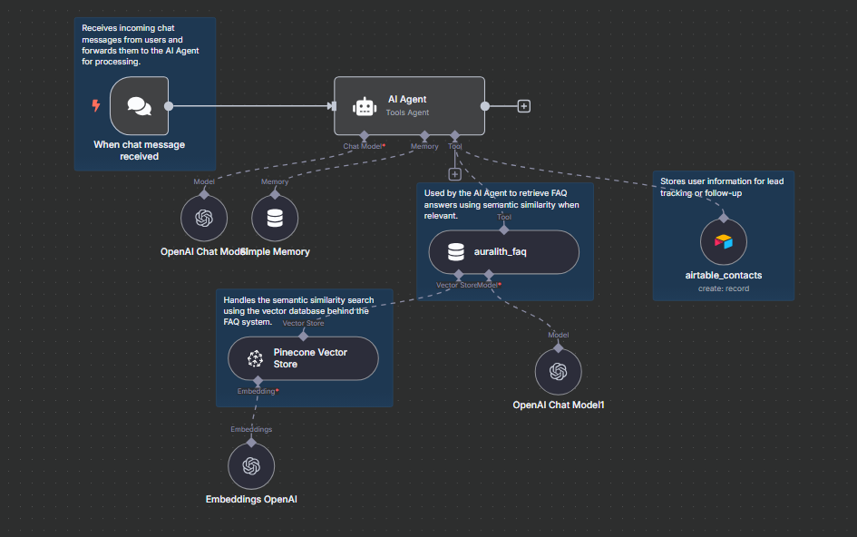
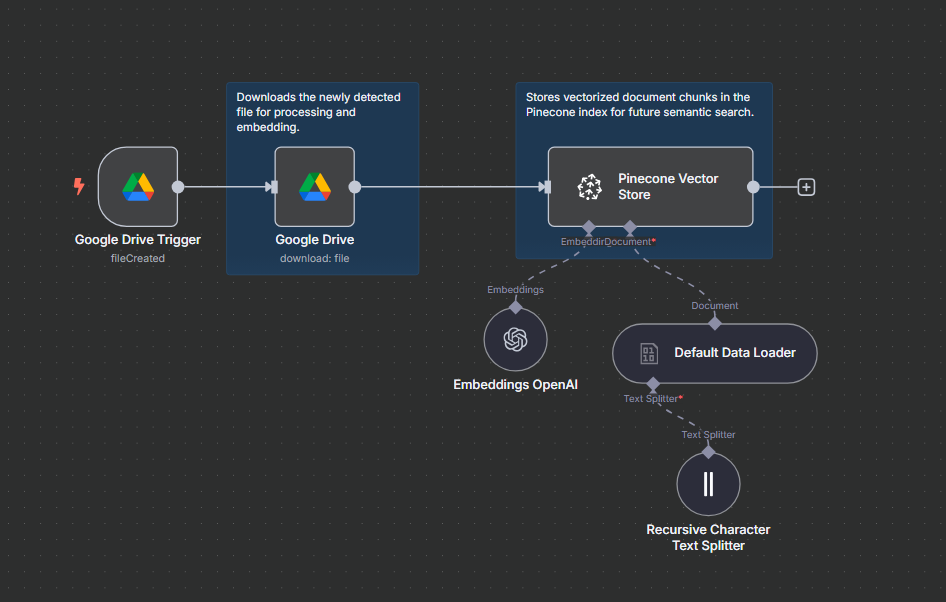

# Auralith FAQ Chatbot

This project contains two n8n workflows that power the Auralith FAQ Chatbot: a chat assistant capable of responding to user messages using a vector-based FAQ system, and an uploader that keeps the knowledge base up to date via Google Drive.

## Overview

The chatbot is built from two connected workflows:

1. **Auralith Chat Agent**  
   Handles incoming messages, searches a vector FAQ database, and generates natural language responses.

2. **Auralith Uploader**  
   Monitors a Google Drive folder for new files, processes and embeds their content, and stores the embeddings in Pinecone.

## Workflows

### 1. Auralith Chat Agent

This workflow listens for user input and responds intelligently using memory, FAQ retrieval, and OpenAI’s chat model. It can optionally store user data in Airtable.

**Features:**
- Listens for incoming chat messages
- Maintains conversation context with memory
- Uses vector search to retrieve FAQ content
- Generates contextual responses with OpenAI
- Optionally stores user contacts in Airtable

**Diagram:**



**JSON Export:**
- [auralith-chat-agent.json](./workflows/auralith-chat-agent.json)

---

### 2. Auralith Uploader

This workflow ingests documents uploaded to Google Drive and keeps the FAQ database updated by converting them into vector embeddings.

**Features:**
- Detects new files in Google Drive
- Extracts and splits document content
- Generates embeddings using OpenAI
- Stores chunks in Pinecone for semantic retrieval

**Diagram:**



**JSON Export:**
- [auralith-uploader.json](./workflows/auralith-uploader.json)

---

## Technologies Used

- [n8n](https://n8n.io)
- [OpenAI API](https://platform.openai.com)
- [Pinecone](https://www.pinecone.io)
- [Airtable](https://airtable.com)
- [Google Drive API](https://developers.google.com/drive)

## Setup

### Prerequisites

- A running instance of n8n (locally or hosted)
- API keys for OpenAI, Pinecone, Airtable, and Google Drive
- Environment variables configured inside n8n for each integration

### Deployment Steps

1. Import both JSON workflows into your n8n instance.
2. Set up authentication for all services.
3. Connect the Auralith Chat Agent to your preferred messaging platform.
4. Activate the Auralith Uploader to monitor your Google Drive folder.

## Testing

- Upload a `.txt`, `.docx`, or `.pdf` file to Google Drive and verify that it is processed and stored in Pinecone.
- Send a message to the chatbot and confirm that it retrieves and responds with relevant FAQ content.
- Use the "Test workflow" button in n8n to simulate individual steps.

## File Structure

```plaintext
/
auralith-faq-chatbot/
├── README.md
├── images/
│   ├── auralith-chat-agent-annotated.png
│   └── auralith-uploader-annotated.png
├── workflows/
│   ├── auralith-chat-agent.json
│   └── auralith-uploader.json