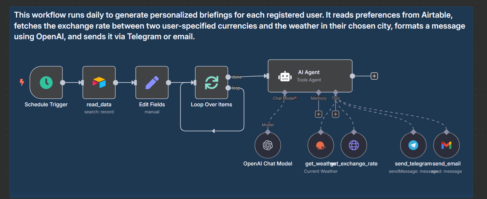
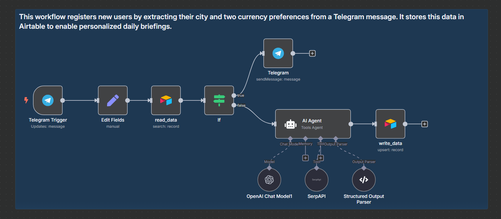

# Daily Briefing Bot

This project contains two n8n workflows that power the Daily Briefing Bot: an automation system that delivers personalized daily updates to users based on their preferences, including local weather and exchange rates.

## Overview

The bot is built from two connected workflows:

1. **Daily Briefing Generator**  
   Runs daily to generate and deliver a briefing for each user based on their saved preferences.

2. **Briefing Register User**  
   Registers new users through Telegram by extracting and storing their city and currency preferences in Airtable.

## Workflows

### 1. Daily Briefing Generator

This workflow runs on a daily schedule to generate personalized briefings. It retrieves user data from Airtable, fetches weather and currency data, formats a message using OpenAI, and sends it via Telegram or email.

**Features:**
- Scheduled execution (e.g. every morning)
- Retrieves user preferences from Airtable
- Gets weather and exchange rate data based on preferences
- Formats personalized messages using OpenAI
- Delivers briefings via Telegram or email

**Diagram:**



**JSON Export:**
- [daily-briefing-generator.json](./workflows/daily-briefing-generator.json)

---

### 2. Briefing Register User

This sub-workflow handles the onboarding of new users by extracting preferences from their Telegram messages using OpenAI and storing them in Airtable.

**Features:**
- Triggered by user interaction on Telegram
- Detects and parses city and two currency codes from user input
- Checks if the user is already registered
- Stores new or updated preferences in Airtable

**Diagram:**



**JSON Export:**
- [briefing-register-user.json](./workflows/briefing-register-user.json)

---

## Technologies Used

- [n8n](https://n8n.io)
- [OpenAI API](https://platform.openai.com)
- [Telegram Bot API](https://core.telegram.org/bots/api)
- [Airtable](https://airtable.com)
- [Weather and Currency APIs](#) *(add links if specific providers are used)*

## Setup

### Prerequisites

- A running instance of n8n (locally or hosted)
- Telegram bot token
- OpenAI API key
- Airtable API key
- Environment variables configured inside n8n

### Deployment Steps

1. Import both JSON workflows into your n8n instance.
2. Set up credentials for Telegram, OpenAI, and Airtable.
3. Activate the Briefing Register User workflow to collect user preferences.
4. Schedule and activate the Daily Briefing Generator to run daily.

## Testing

- Send a message to the Telegram bot to simulate a user registering their preferences.
- Use the "Test workflow" button in n8n to simulate daily execution of the generator.
- Confirm that briefings are correctly generated and sent based on stored data.

## File Structure

```plaintext
/
daily-briefing-bot/
├── README.md
├── images/
│   ├── daily-briefing-generator-annotated.png
│   └── briefing-register-user-annotated.png
├── workflows/
│   ├── daily-briefing-generator.json
│   └── briefing-register-user.json