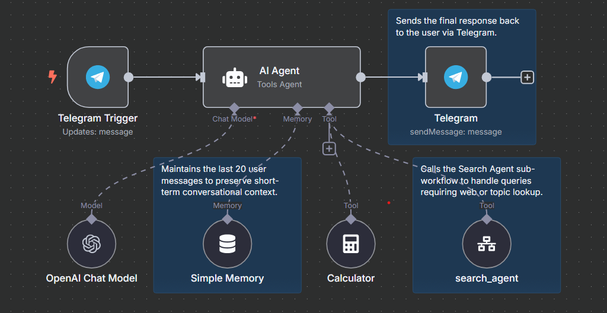
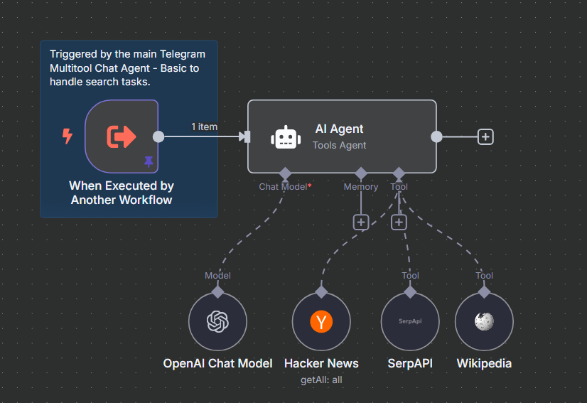

# Telegram Multitool Chat Agent - Basic

This project contains two n8n workflows that power the Telegram Multitool Chat Agent - Basic: a Telegram-based AI chatbot capable of responding to user messages using OpenAI, and performing search tasks via a modular sub-workflow.

## Overview

The chatbot is built from two connected workflows:

1. **Telegram Multitool Chat Agent - Basic**  
   Handles incoming Telegram messages, responds using OpenAI, and routes queries to built-in tools based on intent.

2. **Search Agent**  
   A modular sub-workflow triggered by the main chat agent to handle search-related queries via SerpAPI, Wikipedia, and Hacker News.

## Workflows

### 1. Telegram Multitool Chat Agent - Basic

This workflow listens for Telegram messages and uses an AI agent to determine the appropriate response. It supports memory, basic arithmetic, and invoking a search module.

**Features:**
- Listens for incoming Telegram messages
- Maintains short-term memory across messages
- Generates responses with OpenAI
- Uses tools for calculations and external search
- Sends final output back to the user via Telegram

**Diagram:**



**JSON Export:**
- [telegram-multitool-basic.json](./workflows/telegram-multitool-basic.json)

---

### 2. Search Agent

This workflow is triggered by the main chat agent when a search task is required. It uses external APIs to gather and return search information.

**Features:**
- Triggered as a sub-workflow
- Performs general web search via SerpAPI
- Retrieves summaries from Wikipedia
- Queries Hacker News for relevant results

**Diagram:**



**JSON Export:**
- [search-agent.json](./workflows/search-agent.json)

---

## Technologies Used

- [n8n](https://n8n.io)
- [OpenAI API](https://platform.openai.com)
- [Telegram Bot API](https://core.telegram.org/bots/api)
- [SerpAPI](https://serpapi.com)

## Setup

### Prerequisites

- A running instance of n8n (locally or hosted)
- Telegram bot token
- OpenAI API key
- SerpAPI key
- Environment variables configured inside n8n

### Deployment Steps

1. Import both JSON workflows into your n8n instance.
2. Set up credentials for Telegram, OpenAI, and SerpAPI.
3. Connect the Telegram Multitool Chat Agent to your Telegram bot.
4. Test search and calculator queries to verify full integration.

## Testing

- Send a basic message to the Telegram bot and confirm an OpenAI-based reply.
- Try a math query (e.g. "What is 7 x 8?") to trigger the calculator.
- Try a search query (e.g. "What is Rust programming language?") to trigger the Search Agent.
- Use the "Test workflow" button in n8n to simulate individual components.

## File Structure

```plaintext
/
telegram-multitool-basic/
├── README.md
├── images/
│   ├── telegram-multitool-basic-annotated.png
│   └── search-agent-annotated.png
├── workflows/
│   ├── telegram-multitool-basic.json
│   └── search-agent.json
