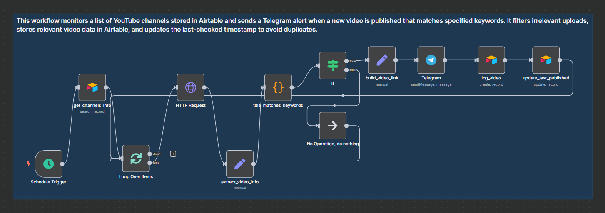

# YouTube Tracker

This project contains a single n8n workflow that monitors a list of YouTube channels and sends Telegram alerts when new videos are published **that match custom keywords** for each channel. It also logs matched videos to Airtable.

## Overview

The workflow is designed to run on a recurring schedule (e.g. every 3 hours). It fetches the latest video for each channel in the `channels` Airtable table and compares it against:

- The last published video date (to avoid duplicates)
- A list of custom keywords per channel (to filter relevance)

If a new video matches any keyword, a Telegram alert is sent and the video is logged in a second Airtable table.

## Workflow

### 1. YouTube Tracker

This workflow combines multiple services to create a smart, automated YouTube monitor.

**Features:**
- Scheduled execution every three hours
- Retrieves a list of tracked channels from Airtable
- Fetches the latest video for each channel via the YouTube Data API
- Filters by publication date and keyword match
- Sends Telegram notifications only for relevant videos
- Logs matched videos to an Airtable `videos` table
- Updates the `last_published_at` field in the `channels` table to prevent reprocessing

**Diagram:**



**JSON Export:**
- [youtube-tracker.json](./youtube-tracker.json)

---

## Technologies Used

- [n8n](https://n8n.io)
- [YouTube Data API](https://developers.google.com/youtube/v3)
- [Telegram Bot API](https://core.telegram.org/bots/api)
- [Airtable](https://airtable.com)

## Setup

### Prerequisites

- A running instance of n8n (locally or hosted)
- Telegram bot token
- YouTube Data API key
- Airtable API key and Base ID
- Two Airtable tables:  
  - `channels` (with `channel_id`, `channel_name`, `keywords`, `last_published_at`)
  - `videos` (logs matched videos)

### Deployment Steps

1. Import the workflow JSON into your n8n instance.
2. Set up credentials for Airtable, YouTube API, and Telegram.
3. Configure your cron trigger to run every few hours.
4. Test the workflow manually to verify integration.

## Testing

- Manually insert a YouTube channel with known recent uploads and keywords in Airtable.
- Trigger the workflow in n8n.
- Confirm that a matching video triggers a Telegram message and is logged to Airtable.
- If no keyword matches, no notification should be sent.

## File Structure

```plaintext
youtube-tracker/
├── README.md
├── youtube-tracker.json
├── youtube-tracker-annotated.png